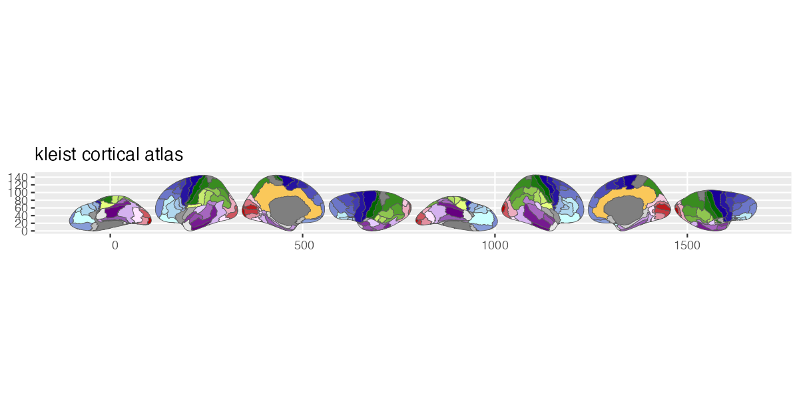

# ggsegKleist

Kleist Atlas for the ggsegverse Ecosystem.

## Installation

``` r
# install.packages("remotes")
remotes::install_github("ggsegverse/ggsegKleist")
```

## Usage

``` r
library(ggsegKleist)
library(ggseg)

plot(kleist()) +
  theme_brain()
```

## Atlas

### kleist

Kleist 1934 functional segregation with 49 regions per hemisphere (Pijnenburg et al., 2021).


