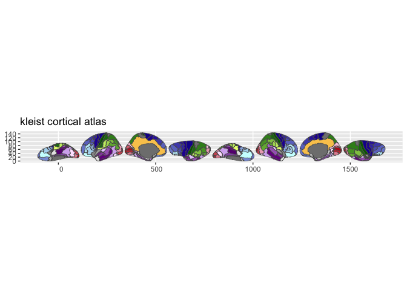

# ggsegKleist

Kleist Atlas for the ggsegverse Ecosystem.

## Installation

``` r
# From r-universe
install.packages("ggsegKleist", repos = "https://ggsegverse.r-universe.dev")

# From GitHub
# install.packages("remotes")
remotes::install_github("ggsegverse/ggsegKleist")
```

## Atlases

### kleist

Kleist 1934 functional segregation with 49 regions per hemisphere.

``` r
library(ggsegKleist)
plot(kleist())
```

 \## Data source

Annotation files from Pijnenburg et al. (2021) supplementary materials.

- **Reference**: Kleist (1934); Pijnenburg et al. (2021)
  [doi:10.1016/j.neuroimage.2021.118274](https://doi.org/10.1016/j.neuroimage.2021.118274)

- **Date obtained**: 2026-02-21
